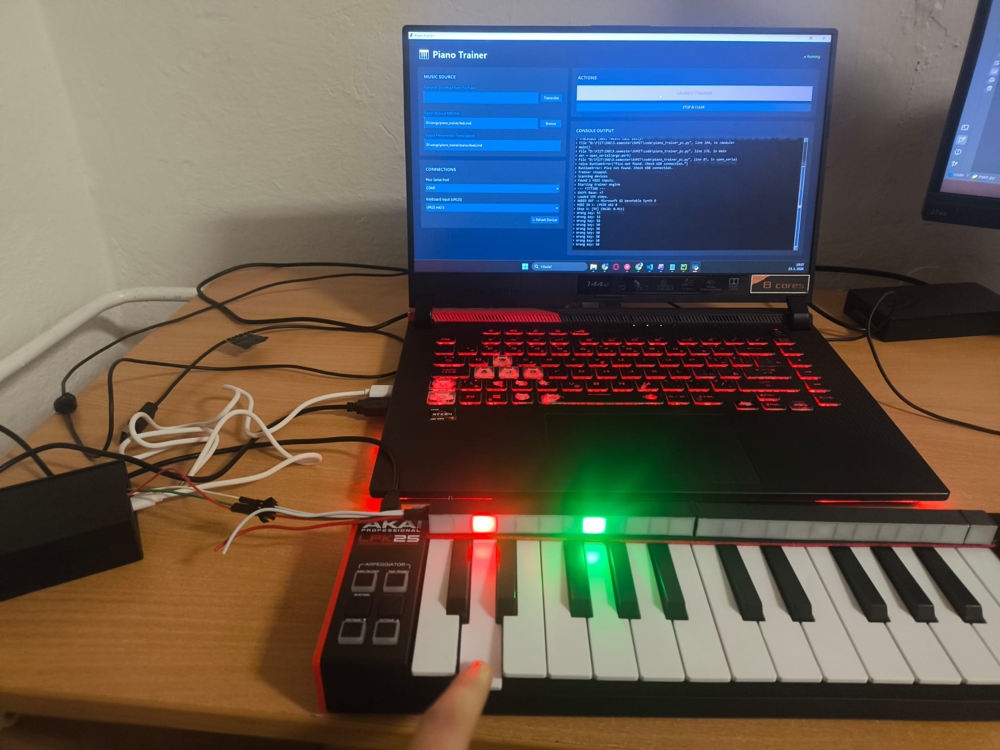
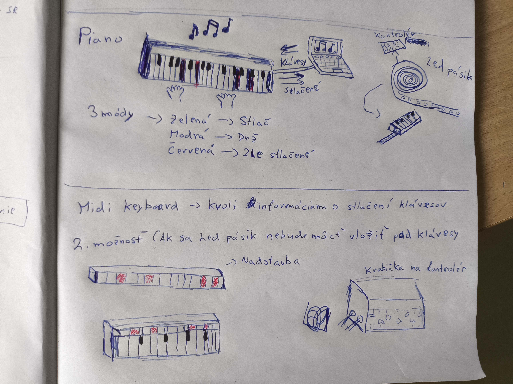
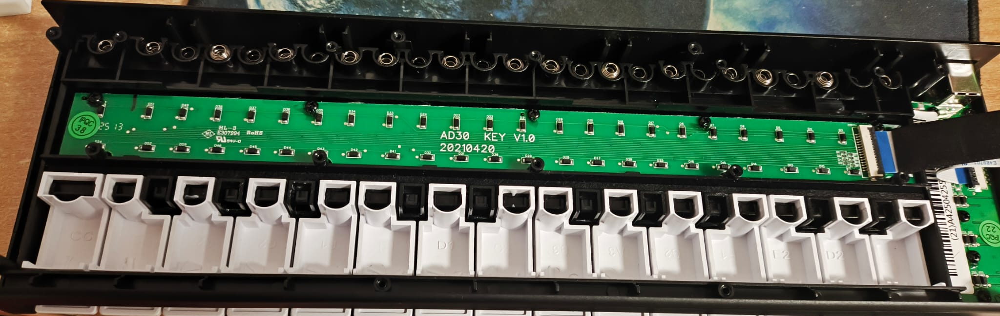
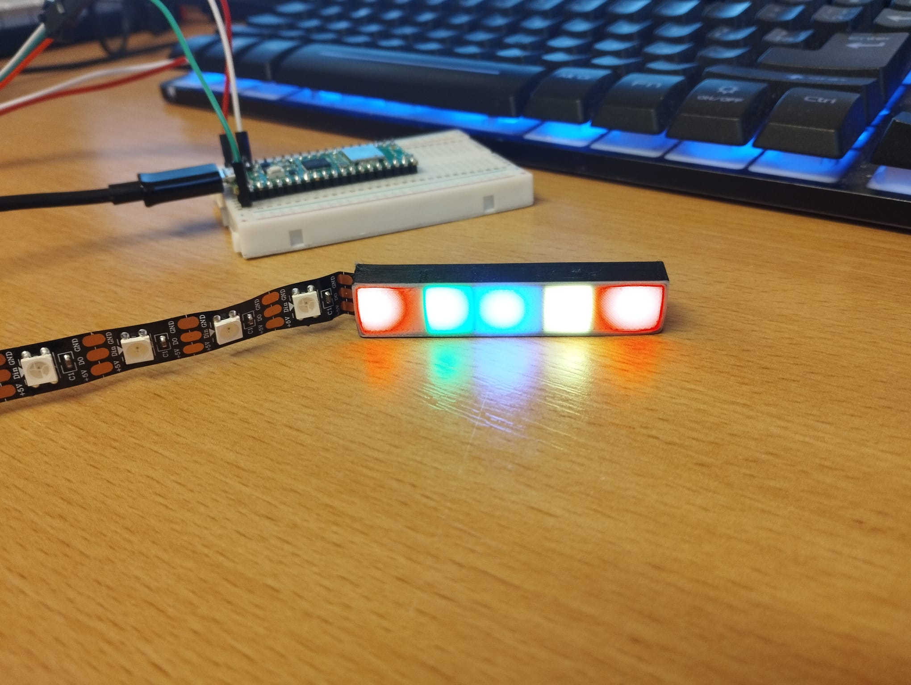
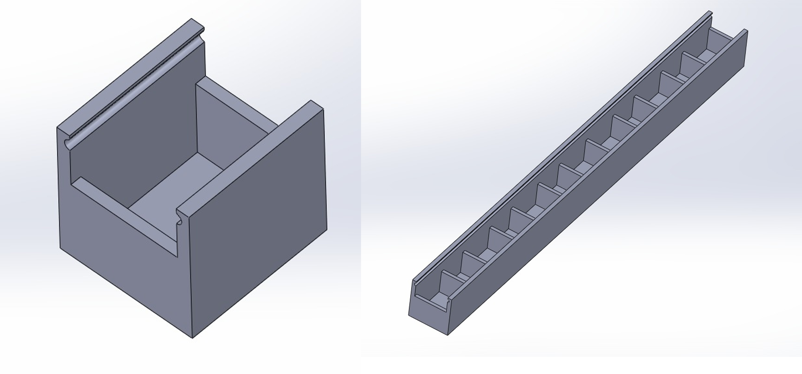
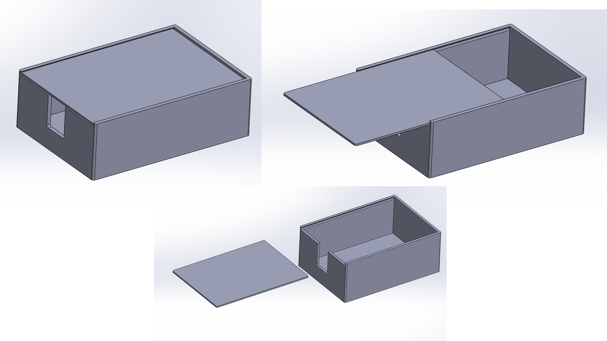
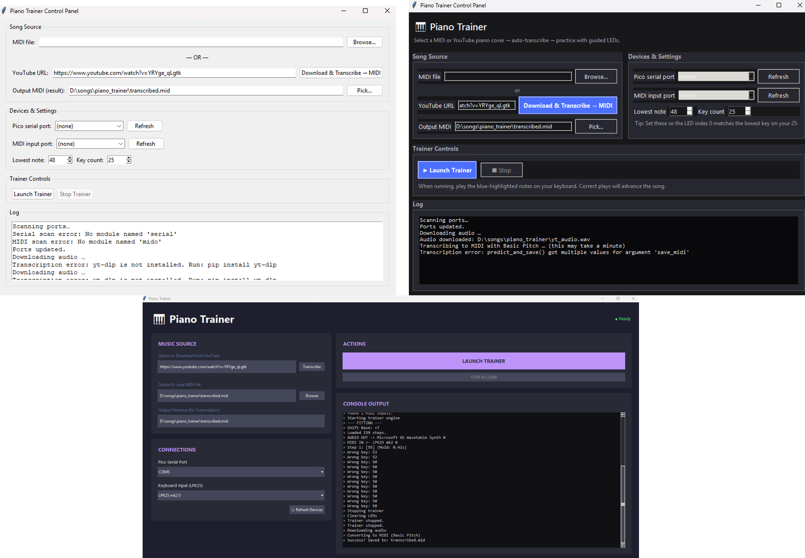
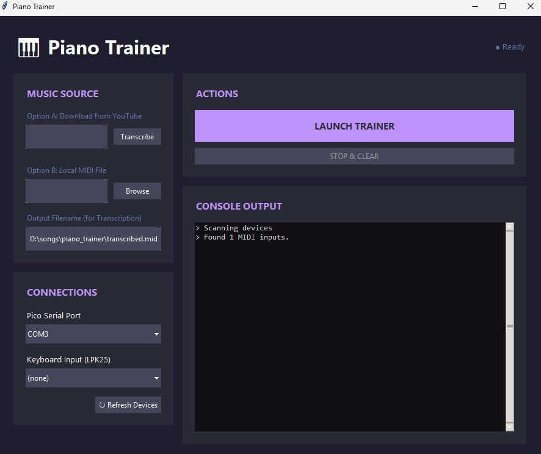

---
# 🧩 Versioning & Metadata
fm_version: "1.0.1"
fm_build: "2025-11-28T15:54:47.934906+00:00"
guid: "bb932a13-3548-44a8-9b85-08bdd103e9f1"
dao: "class_sthdf_dashboard"
title: "LED Piano Trainer Presentation"
author: "Samuel Kohút"
locale: "sk"
status: "final"
privacy: "public"
license: "CC-BY-NC-SA-4.0"
copyright: "© 2026 Samuel Kohút"
---

[🏠 Domov](../index.md)

# 🎹 LED Piano Trainer
### Svetelná pomôcka na učenie hry na klavíri

**ID Projektu:** STHDF-LEDPIANO  
**Autor:** Samuel Kohút

---

## 💡 Ako to celé začalo

Moje prvé úvahy smerovali k zjednodušeniu života v záhrade alebo tréningu psa. Premýšľal som nad automatickým trénovačom psov, automatickým robotom pre sypanie granúl, automatickými dverami do klietky pre psa a automatickým pumpovacím systémamom, ktorý by púšťal dažďovú vodu do ostatných nádob alebo len do odpadoveho miesta.

| Pomôcky pre psa (Nákres) | Záhradný systém (Nákres) |
|:---:|:---:|
|  |  |

*   **Problém:** Testovanie a implementovanie by vyžadovalo dochádzanie 10 hodín (Snina vs. Bratislava). To bolo počas semestra nereálne.
*   **Rozhodnutie:** Vydať sa smerom k nápadu, ktorý môžem plne vyvinúť a testovať v domácich "lab" podmienkach na stole.

---

## 🎨 Od nápadu k riešeniu (LED Piano)

Spomenul som si na svoj starý nápad. Pomôcka, ktorá ti ukáže, čo máš hrať na klavíri pomocou svetiel.

| LED Piano (nákres) |
|:---:|
|  |

**Základný princíp** bol, že LED diódy sa zasvetia na konkrétnu farbu podľa typu ackcie, čo má používateľ vykonať:
  1.  **Zelená:** = Stlač
  2.  **Modrá:** = Drž
  3.  **Červená:** = Chyba  

**Implementácia:** Rozhodovanie medzi rozobratím klávesnice a externou lištou.

---

## 🚀 Ciele a Architektúra

### 1. Business & Účel
**Cieľ:** Vytvoriť fyzickú pomôcku, ktorá premení učenie klavíra na vizuálnu rytmickú hru. Zjednodušiť tak učenie hry na klavíri pre deti a začiatočníkov.
*   **Cieľová skupina:** Deti, úplní začiatočníci a učitelia hudby hľadajúci motivačné a interaktívne pomôcky.
*   **Business Hodnota:** Odstránenie bariéry čítania zložitých nôt v začiatkoch a možnosť vyrobenia dostupnej a replikovateľnej fyzickej pomôcky.

---

### 2. Top Level a Solution Architektúra
**LED Piano Trainer** predstavuje malý, ale kompletný systém, ktorý demonštruje princípy systémového myslenia. Skladá sa z navzájom prepojených vrstiev (hardvér, softvér a ľudská interakcia), ktoré spolu tvoria fungujúci ekosystém. Každá vrstva závisí od ostatných a celkové správanie vyplýva z ich vzájomnej spolupráce, nie z ktorejkoľvek samostatnej časti.

graph TD
    subgraph Human_Interaction [Ľudská vrstva]
        User[Používateľ/Sesternica]
    end

    subgraph Software_Layer [Softvérová vrstva - PC]
        App[Piano Trainer App]
        Transcription[AI Transkripcia]
    end

    subgraph Hardware_Layer [Hardvérová vrstva]
        Pico[Raspberry Pi Pico]
        LED[3D LED Nadstavba]
        Keyboard[MIDI Keyboard]
    end

    User -->|Sleduje svetlo| LED
    User -->|Stláča klávesy| Keyboard
    Keyboard -->|MIDI signál| App
    App -->|Validácia stlačenia| User
    App -->|Príkazy Serial| Pico
    Pico -->|Ovláda| LED
    Transcription -->|Generuje noty| App

#### 🛠️ Hardvérové komponenty
| Komponent | Popis | Účel |
| :--- | :--- | :--- |
| **Raspberry Pi Pico** | Mikrokontrolérová doska | Riadi LED diódy a spracúva hlavnú logiku. |
| **Breadboard** | Prototypová doska | Umožňuje prepájanie komponentov bez spájkovania. |
| **LED diódy** | Adresovateľný pás | Vizuálne indikátory pre jednotlivé klávesy klavíra. |
| **Jumper káble** | Konektory M-M | Prepájajú piny Pico dosky s LED pásom a napájaním. |
| **Napájanie / USB** | 5V USB zdroj | Napája Pico a celý LED okruh. |

#### 💻 Softvérové nástroje
| Nástroj | Popis | Účel |
| :--- | :--- | :--- |
| **Python, MicroPython** | Programovací jazyk | Jazyk pre vytvorenie interaktívnej aplikácie na riadenie celého flowu hrania na takomto klavíri. |
| **MicroPython** | Programovací jazyk | Jazyk pre Pico, ktorý definuje logiku ovládania LED. |
| **Thonny IDE** | Vývojové prostredie | Používa sa na písanie, ladenie a nahrávanie kódu. |

#### 💻 Infraštruktúra
| Nástroj | Popis | Účel |
| :--- | :--- | :--- |
| **GitHub Repozitár** | Verziovací systém | Bezpečné ukladanie súborov projektu a dokumentácie. |
| **OneNote** | Dokumentačný nástroj | Sledovanie progresu, inžiniersky denník a reflexia. |

---

### 3. Solution Architektúra

Solution architektúra sa zameriava na tok dát a fyzické prepojenie, ktoré umožňuje transformáciu YouTube videa na svetelný signál.

#### 🔄 Komunikačný a dátový tok (Data Pipeline)
Systém využíva distribuovanú logiku, kde sa náročné operácie vykonávajú na PC a real-time operácie na mikrokontroléri:
1.  **Spracovanie dát (PC):** Python aplikácia konvertuje zdroj (YouTube link/MIDI) na sekvenciu nôt. Využíva AI knižnice na transkripciu zvuku.
2.  **Protokol (Serial):** PC posiela serializované príkazy cez USB do Pico.
3.  **Mapovanie (Pico):** Firmvér prijme MIDI notu a podľa mapy (Key-to-LED) určí index na LED páse.
4.  **Svetelný výstup (Hardware):** Cez PIO driver rozsvieti konkrétnu WS2812B diódu s presným časovaním.

sequenceDiagram
    participant YT as YouTube / MIDI File
    participant PC as Python App (PC)
    participant Pico as Raspberry Pi Pico
    participant LED as LED Pás

    YT->>PC: Zdrojové dáta (Audio/MIDI)
    Note over PC: AI Transkripcia (Basic Pitch)
    PC->>PC: Mapovanie Noty na LED Index
    PC->>Pico: Serial príkaz (Index, Farba)
    Pico->>LED: PIO Signál (Svietenie)
    Note right of LED: Vizualizácia tónu

#### 🔌 Fyzická schéma zapojenia
Tu vidíme, ako Raspberry Pi Pico slúži ako most medzi digitálnym príkazom a elektrickým signálom pre LED pás.

**Najdôležitejšie technické aspekty zapojenia (Podrobnejšie v Knife):**
- **Napájanie:** Pico aj LED pás sú napájané spoločne z 5V VBUS linky (USB). To zjednodušuje kabeláž.
- **Dátová linka:** Použitý je Pin GP0 s rezistorom na ochranu dátového vstupu LED pásu.
- **Izolácia:** 3D tlačená nadstavba zabezpečuje fyzickú izoláciu svetla, aby každá LED osvetľovala práve jeden „box“ prislúchajúci klávesu.

---

## 🔍 4. Analýza

Po hĺbkovej analýze fyzického MIDI keyboardu (rozobratie) som identifikoval technologické stopky:
*   **Nepriehľadný materiál:** Klávesy sú z materiálu, ktorý svetlo nepohlcuje, ale blokuje.
*   **Mechanické obmedzenie:** Čierne klávesy majú mechaniku, ktorá neumožňuje vedenie káblov bez deštrukcie nástroja.
*   **Verdikt:** Architektonická zmena z vnútorného svietenia na externú LED nadstavbu, ktorá sa položí/pripevní na piano.

graph LR
    Start((Idea: LED v klávesoch)) --> Inspect[Rozobratie piana]
    Inspect --> Problem1{Materiál?}
    Inspect --> Problem2{Priestor?}
    
    Problem1 -- Nepriehľadný --> Reject[ZAMIETNUTÉ]
    Problem2 -- Nedostatok miesta --> Reject
    
    Reject --> Pivot((Riešenie: Externá nadstavba))
    Pivot --> Design[3D Modelovanie boxov]
    Design --> Success[Finálny produkt]
    
    style Reject fill:#f96,stroke:#333,stroke-width:2px
    style Success fill:#9f9,stroke:#333,stroke-width:4px

---

## 5. Design a 3D Tlač

Design musel vyriešiť nesúlad viacerých vecí. Najprv sa musela vyriešiť správna izolácia svetla. Hrúbka priečok musela byť optimalizovaná aby sa zamedzilo presvitaniu do susedných boxov a zároveň presvítaniu hlavnej steny. Ďalším problémom bol nesúlad medzi rozostupom LED diód a samotnej šírke klávesov. Modulárna lišta teda musela byť navrhnutá tak, aby sa LED pás v každom boxe mierne ohol. Tým by sa dído vycentrovala presne na stred klávesu.

Vzhľadom na tieto obmedzenia a experimenty vznikla finálna verzia boxu pre jednu oktávu + krabička pre ochranu mikrokontroléra a kabeláže.

| Finálna lišta pre LED pás | Finálna krabička pre mikrokontrolér  |
|:---:|:---:|
|  |  |

---

## 💻 6. Implementácia a Softvér

Softvér nie je len prehrávač, je to orchestračný nástroj. Vývoj prebiehal v troch evolučných vlnách. To ukazuje postupné vylepšovanie UX a robustnosti systému:

1.  **MVP (First Draft):** Iba základné tlačidlá, testovanie sériového spojenia a statického svietenia.
2.  **Beta (Experimentálne):** Pridanie MIDI detekcie a integrácia AI transkripcie.
3.  **Gold (Finálne):** Moderné GUI, podpora YouTube linkov, vizualizácia konzoly a dynamické mapovanie portov.

Vyvinul som komplexnú desktopovú aplikáciu "Piano Trainer" v Pythone, ktorá slúži ako riadiace centrum.

*   **Vlastnosti:** Detekcia MIDI zariadení, správa portov, AI transkripcia nôt z YouTube a komplexný prehrávač MIDI súborov.

---

## ✅ Testovanie a Prevádzka (SDLC 07-08)

Systém bol testovaný na latenciu a presnosť mapovania nôt na jednotlivé LED boxy.

[LED Piano Showcase](https://www.youtube.com/channel/UCLhs0rJtaIgpV-ZW6BezcAQ)

> YouTube demonštrácia LED reakcií na prehrávané tóny.

*   **Výsledok:** Systém úspešne čaká na vstup používateľa (stlačenie klávesu), kým pokračuje v skladbe.
*   **PS:** Schválené aj mladšou sesternicou a bratrancom
---

## 🏆 Zhrnutie a Výsledky

Projekt splnil a v mnohom prekonal pôvodné očakávania.

| LED Lišta na klavíri | Vyvinutá aplikácia |
|:---:|:---:|
|  |  |

*   ✅ **Plne funkčný hardvér:** 3D tlačená lišta + riadiaca jednotka.
*   ✅ **Kompletný softvér:** Pipeline od YouTube linku až po rozsvietenie LED.
*   ✅ **Dokumentácia:** Vytvorené detailné Knowledge Contributions (KNIFES) pre každý krok.

---

## 🧑‍🎓 Viac informácií

*   🎥 **YouTube:** [Pozrieť videá projektu](https://www.youtube.com/channel/UCLhs0rJtaIgpV-ZW6BezcAQ)
*   💼 **LinkedIn:** [Profil projektu LED Piano Trainer](https://www.linkedin.com/in/led-piano-trainer-61495a38b/)
*   📂 **GitHub:** [Zdrojové kódy, 3D modely a technická dokumentácia.](https://github.com/Samuel-Kohut/SMVIT-PON_15_Kohut) 
* 📝 **OneNote** (Class Notebook):  Mám tam opísaný celý vývoj projektu s časovou stopou a s viacerými detailmi. Aj viacero knowledge contributions.

---

## 🧠 Reflexia

*   **Ponaučenie:** Mechanické kompromisy sú pri fyzických produktoch nevyhnutné.
*   **Odkaz:** *"Ak niečo nefunguje, neznamená to, že to je zlý nápad - len to potrebuje inú cestu."*

---

# 🎹 Ďakujem za pozornosť!
### Máte nejaké otázky?

---
[🏠 Späť na domovskú stránku](../index.md)