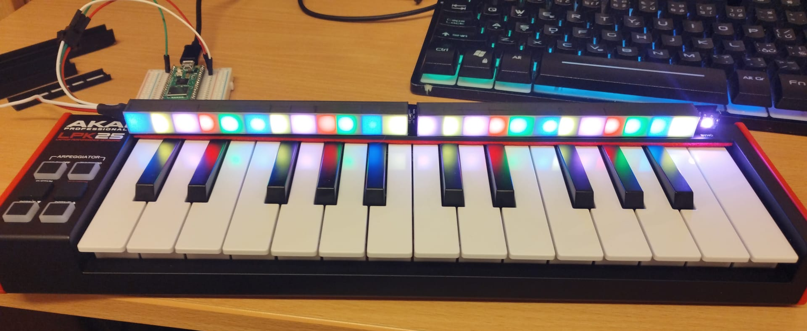
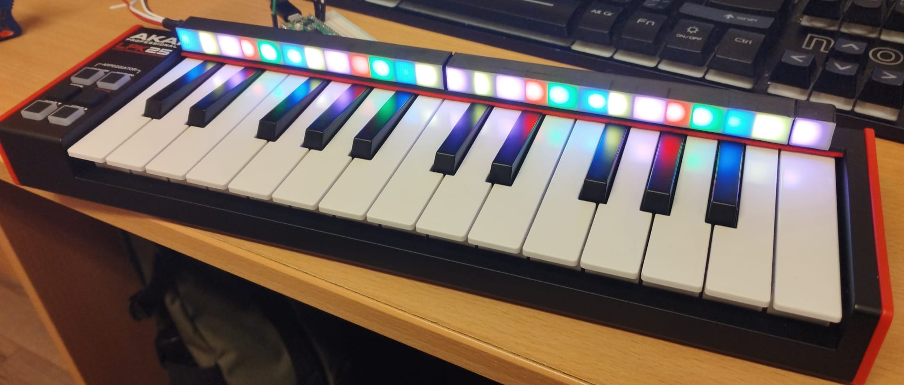
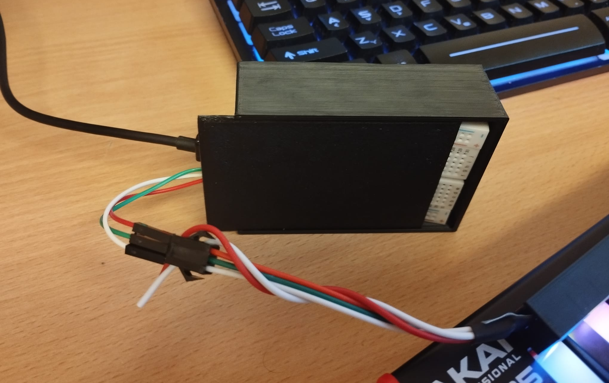
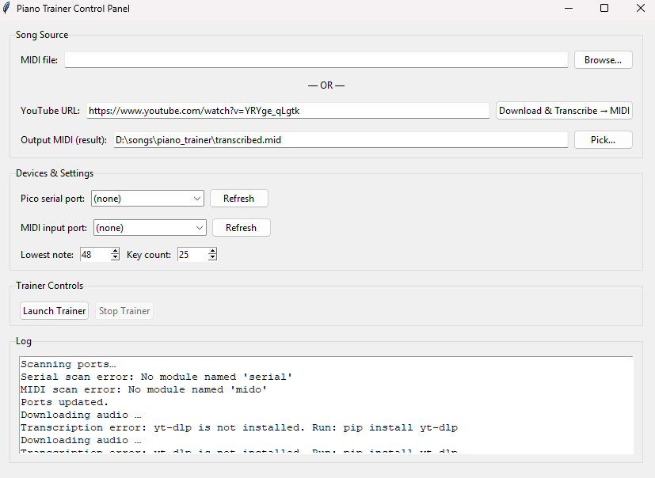
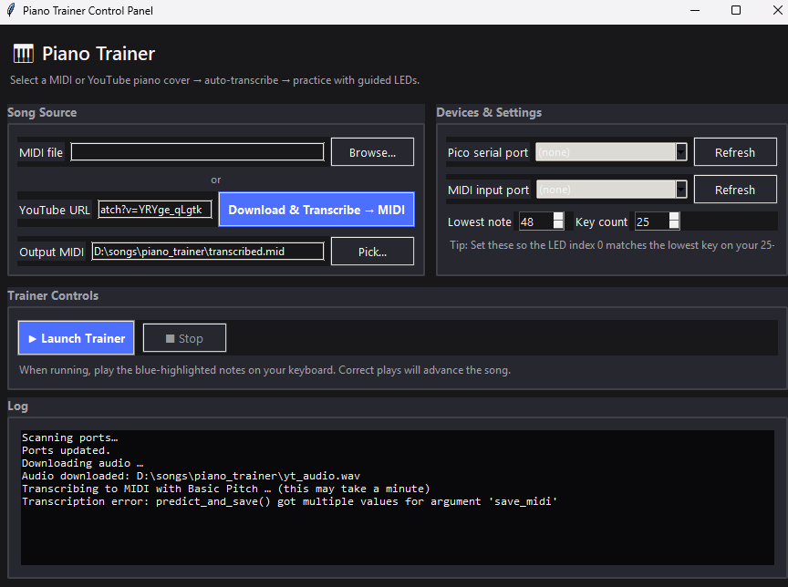

# Project Outcomes

## Dosiahnuté výsledky
- Funkčná hardvérová platforma: Raspberry Pi Pico + WS2812B pás + napájanie + MIDI klavír.  
- Plne funkčná **3D-tlačená LED nadstavba** a krabička na elektroniku, upevnená na klavíri.  
- LED dokážu svietiť v jednotlivých boxoch s dobrou difúziou a zarovnaním.  
- GitHub a OneNote obsahujú úvodnú dokumentáciu, fotky, setup tutoriály a celkový vývoj projektu od jeho počiatkov.

## Knifes
- Nastavenie Raspberry Pi so svetelným LED pásom  
- Nastavenie Raspberry Pi s Thonny prostredím  
- Nastavenie AKAI MIDI klávesnice  
- Nastavenie brand účtu na YouTube (nie je súčasťou verejného repozitára)
- Nastavenie brand účtu na LinkedIne (nie je súčasťou verejného repozitára)
- Nastavenie nášho prodktu pre správne použitie !!!

## 🏆 Finálny produkt

### 🔧 Hardvérový výsledok
Po sérii experimentov s hrúbkou priečok a ohýbaním LED pásu vznikla plne funkčná svetelná nadstavba, ktorá rovnomerne osvetľuje jednotlivé klávesy.

#### Počiatočné experimenty s hrúbkou a ohýbaním
<figure>  </figure>

#### Prvá verzia (chybná – chýbajúci posledný box)
<figure>  </figure>

#### Opravená finálna verzia s doplneným boxom
<figure>  </figure>

#### 3D tlačená krabička pre Raspberry + káble
<figure>  </figure>

### 💻 Softvérový výsledok
Finálna verzia PC aplikácie obsahuje:
- MIDI detekciu  
- prepojenie s Pico  
- generovanie LED sekvencií z MIDI alebo automatickej transkripcie  

#### Piano Trainer App Prvotné
<figure>  </figure>

#### Piano Trainer App Experimentálne
<figure>  </figure>

#### Piano Trainer App Finálne
<figure>  </figure>

### 🎬 Demo video

[LED Piano Showcase](https://www.youtube.com/watch?v=GONJa6kOOnw)

> YouTube demonštrácia LED reakcií na prehrávané tóny.

### 📦 Celkový dodaný produkt
- 3D tlačená LED nadstavba → **kompletne funkčná**  
- Krabička pre Raspberry → **hotová**  
- Prepojenie keyboard → PC → Pico → LED → **funguje**  
- PC aplikácia → **funkčný prototyp (demo-ready)**  
- Firmware pre Pico → **stabilný základ**  

---

🟣 **Výsledok:** Projekt prekročil pôvodné očakávania v kvalite hardvéru a estetickom prevedení. Softvér existuje ako funkčný prototyp pripravený na ďalší rozvoj.

---

## Navigácia
- [↩️ Späť](../index.md)
