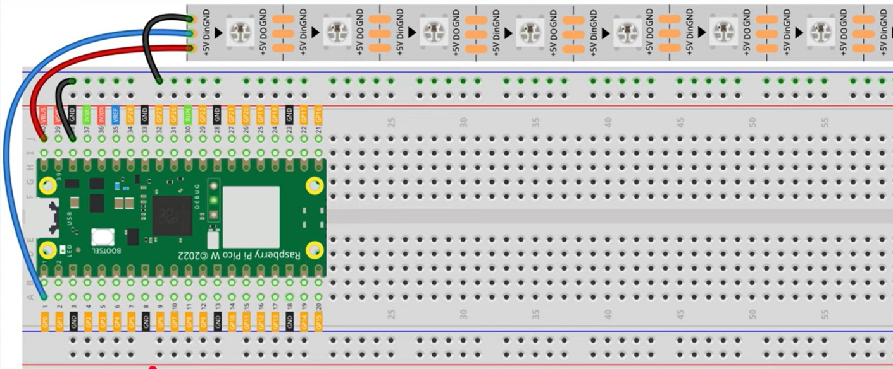
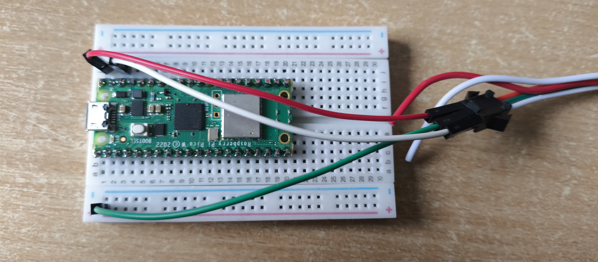

# 📚 Knowledge Contribution

## 🔖 Názov a stručný popis
**Hardvérové zapojenie adresovateľného LED pásika k Raspberry Pi Pico**

Tento KNIFE popisuje, ako fyzicky prepojiť Raspberry Pi Pico s LED pásikom pomocou breadboardu a jumper káblov. Správne zapojenie je nevyhnutným prvým krokom pred samotným programovaním svetelných efektov.

---

## 🎯 Čo rieši (účel, cieľ)
- Umožňuje bezpečné napájanie LED pásika priamo z mikrokontroléra cez USB.
- Zabezpečuje správne prepojenie dátového signálu pre ovládanie jednotlivých diód.
- Poskytuje prehľadný vizuálny návod pre začiatočníkov v elektronike.

---

## 🧩 Ako to rieši (princíp)
- **Napájanie:** Využíva pin **VBUS (5V)**, ktorý berie prúd priamo z USB vstupu.
- **Dáta:** Využíva digitálny pin **GP0** na posielanie riadiacich príkazov.
- **Spoločná zem:** Prepojenie uzemnenia (GND) oboch komponentov pre uzavretie elektrického obvodu.

---

## 🧪 Ako to použiť (aplikácia)
Tento postup využiješ pri:
- vytváraní LED osvetlenia k PC,
- vizualizácii dát (napr. indikátor stavu batérie alebo teploty),
- prototypovaní akéhokoľvek projektu s adresovateľnými LED diódami (WS2812B / NeoPixel).

---

## ⚡ Rýchly návod (Top)

1.  **Priprav si:** Raspberry Pi Pico, breadboard, LED pásik a jumper káble.
2.  **Osadenie:** Zatlač Raspberry Pi Pico do breadboardu.
3.  **Napájanie (+5V):** Prepoj **červený** kábel z pásika na pin č. 40 (VBUS).
4.  **Zem (GND):** Prepoj **biely/čierny** kábel z pásika na pin č. 38 (GND).
5.  **Dáta (Data):** Prepoj **zelený/modrý** kábel z pásika na pin č. 1 (GP0).
6.  **Hotovo:** Pripoj USB kábel k počítaču.

---

## 📜 Detailný článok

### 1️⃣ Čo budeš potrebovať
Celý tento setup sa dá zaobstarať približne za **30 €**:
- **Raspberry Pi Pico:** Cenovo najdostupnejší mikrokontrolér, ideálny pre túto architektúru.
- **Adresovateľný LED pásik:** Napr. typ WS2812B.
- **Breadboard:** Na prepojenie bez potreby spájkovania.
- **Jumper káble (M-M):** "Samec-samec" kábliky na prepojenie komponentov.

### 2️⃣ Postup zapojenia podľa schémy
Pre správnu funkčnosť postupuj presne podľa pinov na obrázku:

- **VBUS (Pin 40):** Poskytuje 5V napájanie priamo z USB. Tu pripojíme napájací kábel LED pásika.
- **GND (Pin 38):** Uzemnenie. Na Pico je ich viac, ale pin 38 je ideálne umiestnený pri VBUS.
- **GP0 (Pin 1):** Dátový výstup, ktorý bude hovoriť každej LED dióde, akou farbou má svietiť.

<figure>  </figure>

### 3️⃣ Fyzická realizácia
Pri fyzickom zapájaní sa uisti, že sú jumper káble pevne zasunuté v breadboarde. Ak tvoj LED pásik nemá predpripravené konektory, budeš musieť na jeho konce pripájkovať piny alebo použiť svorkovnicu.

<figure>  </figure>

---

## 💡 Tipy a poznámky
- **Pozor na smer dát:** LED pásiky sú smerové. Dáta (zelený kábel) musia ísť do vstupu označeného ako **DIN** alebo šípkou smerujúcou "dovnútra" pásika.
- **Prúdový limit:** Ak plánuješ svietiť na plný jas s viac ako 10-15 diódami, USB port počítača ich nemusí utiahnuť. Vtedy odporúčame znížiť jas v kóde alebo použiť externý zdroj.
- **Izolácia:** Daj pozor, aby sa odizolované konce káblov v breadboarde navzájom nedotýkali.

---

## ✅ Hodnota / Zhrnutie
Po absolvovaní tohto návodu máš pripravený hardvér. Tvoje Raspberry Pi Pico je teraz elektricky prepojené s LED pásikom a pripravené na nahranie MicroPython kódu, ktorý rozsvieti tvoj projekt.

---

## 🗂️ Taxonómia KNIFE
- **Kategória:** IT / Hardware / IoT
- **Typ:** návod
- **Tagy:** raspberry pi pico, led strip, ws2812b, breadboard, setup

---

## 🌍 Referencie
- [Raspberry Pi Pico Pinout dokumentácia](https://www.raspberrypi.com/documentation/microcontrollers/raspberry-pi-pico.html)
- [How To Control WS2812B Individually Addressable LEDs using the Raspberry Pi Pico](https://www.youtube.com/watch?v=MCBSYVftAWE&t)

---

## Navigácia
- [↩️ Späť](../02_knowledge-contribution.md)