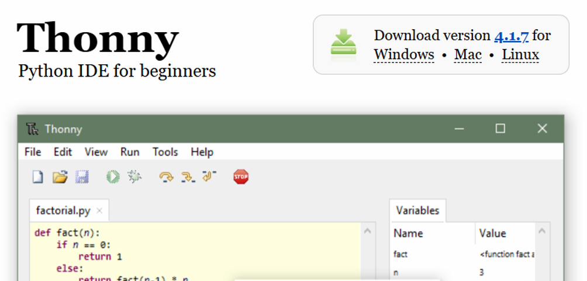
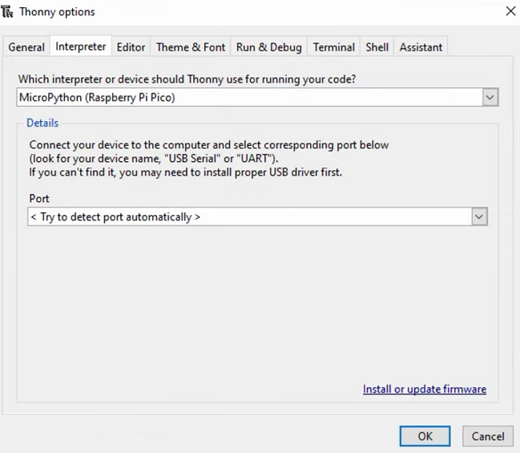

# 📚 Knowledge Contribution

## 🔖 Názov a stručný popis
**Nastavenie Thonny IDE pre Raspberry Pi Pico**

Tento KNIFE vysvetľuje, ako nainštalovať Thonny, zvoliť správny interpreter pre Raspberry Pi Pico a aktivovať MicroPython firmware.  
Je dôležitý, pretože bez správneho nastavenia interpretéra nemôžeme spúšťať kód na Pico.

---

## 🎯 Čo rieši (účel, cieľ)
- Správne a rýchle nastavenie Thonny na akomkoľvek OS.  
- Aktiváciu MicroPython firmvéru na Raspberry Pi Pico.  
- Vytvorenie funkčného spojenia medzi Pico a počítačom.

---

## 🧩 Ako to rieši (princíp)
- Thonny umožňuje jednoducho pracovať s MicroPython kódom.  
- Voľbou správneho interpretéra sa Thonny spojí s mikrokontrolérom.  
- Firmware sa nainštaluje priamo cez Thonny.

---

## 🧪 Ako to použiť (aplikácia)
Použiteľné pri:
- prvotnom nastavovaní Raspberry Pi Pico,  
- programovaní v MicroPythone,  
- nahrávaní skriptov do mikrokontroléra.

---

---

## ⚡ Rýchly návod (Top)

1. Prejdi na **https://thonny.org**  
2. Stiahni inštalátor pre svoj operačný systém.  
3. Nainštaluj Thonny s odporúčanými nastaveniami.  
4. Pripoj Raspberry Pi Pico k počítaču cez USB.  
5. V Thonny: **Run → Select interpreter...**  
6. Vyber interpretér: *MicroPython (Raspberry Pi Pico)*  
7. Klikni *Install or update firmware*  
8. Potvrď *OK*  
9. Zapni *View → Files* pre zobrazenie súborov Pico.  
10. Hotovo – môžeš spúšťať MicroPython kód.

---

## 📜 Detailný článok

### 1️⃣ Stiahnutie Thonny
Prejdite na oficiálnu stránku:

➡️ **https://thonny.org**

Vyberte operačný systém a stiahnite inštalačný súbor.

<figure>  </figure>

---

### 2️⃣ Inštalácia Thonny
Spustite `.exe` (alebo ekvivalent) a používajte odporúčané nastavenia:

- Next → Next → Finish

Po dokončení Thonny spustite.

---

### 3️⃣ Nastavenie interpretéra
Pripojte Raspberry Pi Pico k počítaču.  
V Thonny otvorte:

➡️ **Run → Select interpreter...**

Zobrazí sa okno:

<figure>  </figure>

Nastavte:

- Interpreter: **MicroPython (Raspberry Pi Pico)**  
- Port: Auto-detect  

Kliknite na **Install or update firmware**.

---

### 4️⃣ Inštalácia MicroPython firmvéru
Thonny ponúkne najnovší dostupný firmware.  
Kliknite na **Install** a po dokončení **OK**.

---

### 5️⃣ Zobrazenie súborov na Pico
Zapnite:

➡️ **View → Files**

Tým získate prístup k súborom:

- na vašom počítači 
- na Raspberry Pi Pico

---

### 6️⃣ Overenie funkčnosti
V pravom dolnom rohu Thonny by malo byť zobrazené:

**MicroPython (Raspberry Pi Pico)**

Ak áno → všetko je nastavené správne a môžete začať programovať.

---

## 💡 Tipy a poznámky
- Použite USB kábel, ktorý prenáša aj dáta (nie iba napájanie).  
- Ak sa Pico nezobrazí, skúste BOOTSEL režim.  
- Firmware môžete aktualizovať kedykoľvek cez Thonny.

---

## ✅ Hodnota / Zhrnutie
Po absolvovaní tohto návodu budete mať:

- nainštalovaný Thonny,  
- aktivovaný MicroPython na Pico,  
- nastavený interpreter,  
- funkčné prostredie na spúšťanie kódu.

Raspberry Pi Pico je pripravené na vývoj a experimentovanie.

---

## 🗂️ Taxonómia KNIFE
- **Kategória:** IT / Embedded / MicroPython  
- **Typ:** Návod  
- **Tagy:** thonny, raspberry pi pico, micropython, interpreter, setup

---

## 🌍 Referencie
- https://thonny.org  
- https://micropython.org/download/rp2-pico/

---

## Navigácia
- [↩️ Späť](../02_knowledge-contribution.md)
