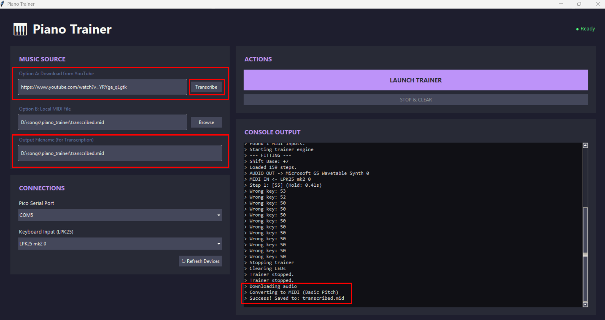

# 📚 Knowledge Contribution

## 🔖 Názov a stručný popis
**Spustenie a ovládanie systému Piano Trainer**
Tento KNIFE predstavuje finálnu integráciu celého projektu. Spája Raspberry Pi Pico s LED pásikom, MIDI klávesnicu a špeciálne vytvorený softvér do jedného funkčného vzdelávacieho systému.

---

## 🎯 Čo rieši (účel, cieľ)
- Transformuje statické učenie hry na klavíri na interaktívny vizuálny zážitok.
- Automatizuje proces získavania nôt z videí na YouTube.
- Poskytuje okamžitú spätnú väzbu pri stlačení klávesov.

---

## 🧩 Ako to rieši (princíp)
- **Spracovanie dát:** Softvér v Pythone analyzuje MIDI súbory a vypočítava presné časovanie medzi tónmi.
- **Sériová komunikácia:** Príkazy sa posielajú cez USB port do Pico, ktoré následne ovláda LED diódy.
- **AI Transkripcia:** Využíva algoritmy na analýzu zvuku z YouTube a jeho prevod do MIDI štruktúry.

---

## 🧪 Ako to použiť (aplikácia)
Tento systém využiješ pri:
- rýchlom učení sa nových skladieb bez znalosti nôt,
- vizualizácii MIDI skladieb v reálnom čase,
- tvorbe podkladov pre cvičenie z YouTube tutoriálov.

---

## ⚡ Rýchly návod (Top)
1. **Zapoj všetko:** Pico s LED, MIDI klávesnicu a USB káble k PC.
2. **Spusti aplikáciu:** Spusti hlavný Python skript (GUI).
3. **Nastav pripojenie:** V sekcii *Connections* prepni port na **COM5**.
4. **Zvoľ skladbu:** Vyber MIDI súbor z disku alebo vlož YouTube link a klikni na *Transcribe*.
5. **Trénuj:** Klikni na **Launch Trainer** a sleduj svetlá nad klávesmi.

  

---

## 📜 Detailný článok

### 1️⃣ Príprava a prepojenie
Pre dosiahnutie tohto bodu musíš mať úspešne dokončené predchádzajúce tri kroky (Pico firmware, LED zapojenie a registráciu MIDI klávesnice). Ak je hardvér pripravený, pripoj všetky zariadenia k počítaču a spusti Python program.

### 2️⃣ Nastavenie zariadení v GUI
Po spustení by mal program automaticky detekovať pripojené zariadenia. Dôležitým krokom je sekcia **Connections**:
- **Pico Serial Port:** Predvolene môže byť nastavený na COM3, ale pre správnu komunikáciu s Pico ho zmeň na **COM5** (alebo port, ktorý priradil tvoj systém).
- **Keyboard Input:** Vyber svoju pripojenú MIDI klávesnicu (napr. LPK25).

### 3️⃣ Výber zdroja hudby
Aplikácia ponúka dve cesty k tréningu:
- **Lokálny súbor (Option B):** Klikni na *Browse* a vyber si akýkoľvek `.mid` súbor. Program ho rozloží na jednotlivé noty a vypočíta čakacie doby medzi nimi.
- **YouTube Transkripcia (Option A):** Vlož odkaz na YouTube video (ideálne piano cover). Po kliknutí na *Transcribe* softvér video spracuje, stiahne zvuk a pomocou AI vytvorí MIDI súbor s notami.

### 4️⃣ Spustenie tréningu
Kliknutím na **Launch Trainer** aktivuješ motor aplikácie. Softvér začne v reálnom čase posielať informácie o notách do Raspberry Pi Pico. LED diódy sa rozsvietia nad tými klávesmi, ktoré máš v danom momente stlačiť. V konzole aplikácie môžeš sledovať výpisy o tom, či si stlačil správny kláves alebo si spravil chybu.

---

## 💡 Tipy a poznámky
- **Kvalita transkripcie:** Pri Option A odporúčame používať videá, kde je čistý zvuk klavíra bez sprievodných nástrojov pre čo najpresnejšie výsledky.
- **COM Porty:** Ak sa zariadenie neobjaví, skús tlačidlo *Refresh Devices*.
- **Priebeh v konzole:** Console Output ti povie presne, čo sa deje v pozadí (sťahovanie, konverzia, chyby pripojenia).

---

## ✅ Hodnota / Zhrnutie
Projekt Piano Trainer mení spôsob, akým ľudia interagujú s hudobným nástrojom. Spojením dostupného hardvéru a inteligentného softvéru vytvára prístupné riešenie pre samoukov, ktoré je flexibilné vďaka integrácii s YouTube.

---

## 🗂️ Taxonómia KNIFE
- **Kategória:** IT / Embedded / Hudobná technológia
- **Typ:** návod / integrácia
- **Tagy:** raspberry pi pico, led strip, midi, python, piano trainer, transcription

---

## 🌍 Referencie
- Dokumentácia k Raspberry Pi Pico Serial komunikácii.
- Basic Pitch (Spotify API pre transkripciu zvuku).

---

## Navigácia
- [↩️ Späť](../02_knowledge-contribution.md)